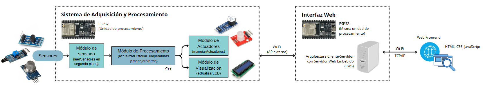
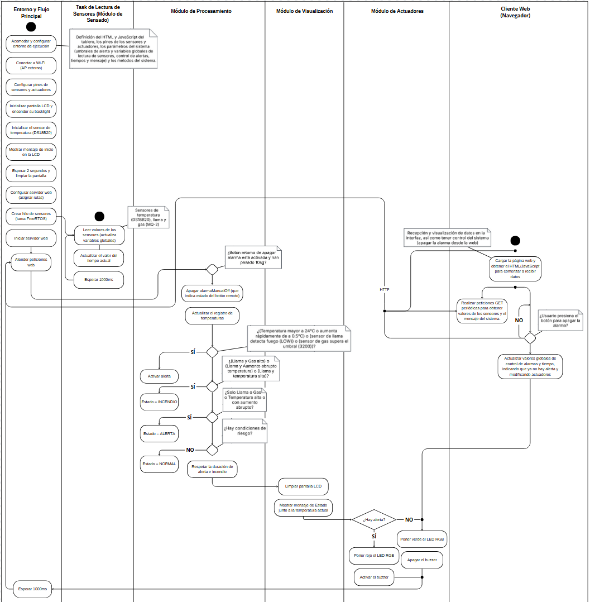
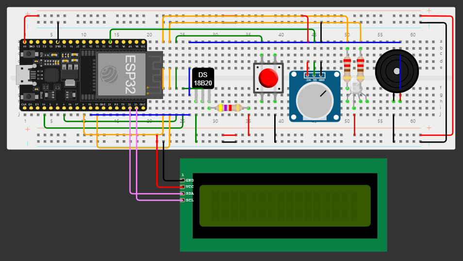

# Sistema IoT para Detección de Incendios en los Cerros Orientales de Bogotá - Challenge 2

## Información del Proyecto
- **Universidad:** Universidad de La Sabana  
- **Facultad:** Facultad de Ingeniería  
- **Materia:** Internet de las Cosas  
- **Profesor:** Juan Manuel Aranda López King  

## Integrantes del Proyecto
| Nombre | Correo Electrónico |
|--------|-------------------|
| Valentina Alejandra López Romero | valentinalopro@unisabana.edu.co |
| Ana Lucía Quintero Vargas | anaquiva@unisabana.edu.co |
| Mariana Valle Moreno | marianavamo@unisabana.edu.co |

## Estructura de la Documentación
- [1. Introducción](#1-introducción)
- [2. Motivación y Justificación](#2-motivación-y-justificación)
- [3. Solución Propuesta](#3-solución-propuesta)
- [4. Configuración Experimental, Resultados y Análisis](#4-configuración-experimental-resultados-y-análisis)
- [5. Autoevaluación del Protocolo de Pruebas](#5-autoevaluación-del-protocolo-de-pruebas)
- [6. Conclusiones, Retos y Mejoras Futuras](#6-conclusiones-retos-y-mejoras-futuras)
- [7. Referencias](#7-referencias)
- [8. Anexos](#8-anexos)

---

## 1. Introducción

Los cerros orientales de Bogotá son fundamentales para la regulación climática y la conservación de la biodiversidad. Su presencia como barrera y protector natural constituye un regulador del clima, del cual depende en buena medida la disponibilidad de agua para la capital y municipios aledaños [1]. Además, son esenciales en la producción de oxígeno en una sabana donde la pérdida de vegetación es creciente, lo que los hace aún más vulnerables a incendios forestales agravados por sequías prolongadas, altas temperaturas y la acumulación de material seco, junto con actividades humanas como fogatas, quemas agrícolas y expansión urbana descontrolada [2].

Para mitigar estos riesgos, es fundamental implementar sistemas de detección de incendios eficientes que permitan una respuesta rápida por parte de las autoridades. La integración de tableros de control en estos sistemas no solo optimiza su operatividad, sino que también permite a las autoridades identificar posibles fallas antes de que se conviertan en emergencias críticas, al proporcionar un monitoreo constante, activar alarmas y generar notificaciones en tiempo real, facilitando una respuesta inmediata. Las soluciones que incorporan este tipo de herramientas no solo protegen bienes materiales, sino también lo más importante: la vida humana. ¡En situaciones de emergencia, cada segundo cuenta! [3].

---

## 2. Motivación y Justificación

 
Actualmente, la detección de incendios en los cerros orientales de Bogotá depende de vigilancia manual o reportes ciudadanos, lo que retrasa la respuesta de las autoridades y agrava los daños ambientales y sociales. Esta falta de monitoreo en tiempo real limita la capacidad de reacción de los organismos de emergencia, aumentando la propagación del fuego y su impacto negativo en la biodiversidad, la calidad del aire y las comunidades aledañas, lo que hace crítica la necesidad de una solución tecnológica eficiente. 

 

 
Para abordar esta problemática, el proyecto propone la implementación de un sistema basado en Internet de las Cosas que permita un monitoreo continuo del entorno y la activación inmediata de alarmas visuales y sonoras en caso de detectar condiciones de riesgo. Además, incorpora un tablero de control web embebido en un ESP32, al cual las autoridades podrán acceder desde un navegador web dentro de la WLAN. A través de esta interfaz, se pueden visualizar en tiempo real el estado de las variables ambientales clave, como temperatura, presencia de llamas y concentración de gases, asi como poder llegar a apagar remotamente estas alarmas físicas y enviar notificaciones de alerta, asegurando una intervención rápida y eficiente ante posibles incendios. 

 
Gracias a su arquitectura autónoma, esta solución ofrecerá un sistema de prevención inteligente, con monitoreo accesible y eficiente, permitiendo optimizar los tiempos de respuesta, minimizar el impacto ambiental de los incendios y fortalecer las estrategias de prevención. 

---

## 3. Solución Propuesta

### Restricciones de Diseño Identificadas

 
Al desarrollar el sistema IoT para detectar incendios en los cerros orientales de Bogotá, se identificaron varias restricciones que afectan su diseño e implementación:

 

#### 1. Técnicas
- Se usa un **ESP32**, el cual tiene un límite en la memoria RAM y el procesamiento, lo que puede afectar la ejecución simultánea del servidor web y la recolección de datos de sensores.
- Los sensores de **temperatura, gas (MQ-2) y llama** requieren calibración para evitar falsas alarmas, además de que tienen tiempos de respuesta y precisión que pueden influir en la detección temprana de incendios.
- La alimentación del sistema debe ser autónoma para funcionar sin conexión a la red eléctrica.
- Para la gestión de múltiples tareas, se implementó un enfoque optimizado que permite la adquisición de datos sin afectar la estabilidad del sistema.
- Dependencia de una conexión estable de WiFi para enviar y visualizar los datos en la interfaz web.

#### 2. Económicas
- Se busca tratar de minimizar costos en la implementación del sistema, eligiendo sensores asequibles y fáciles de conseguir, pero siendo lo suficientemente confiables y precisos para realizar apropiadamente las mediciones.
- No se usan tecnologías más avanzadas, debido a su alto precio.

#### 3. Regulatorias
- Se debe cumplir con normativas ambientales y estándares de seguridad eléctrica para su instalación en entornos protegidos o críticos.
- Cualquier intervención en los cerros debe ajustarse a regulaciones locales.
- En algunos casos, podrían existir regulaciones sobre la transmisión de datos y almacenamiento en servidores remotos.

#### 4. Espaciales
- El sistema debe ser compacto y resistente a condiciones climáticas adversas (lluvia, humedad y polvo).
- Los sensores deben estar ubicados estratégicamente para detectar cambios de temperatura y gases sin interferencias, maximizando su efectividad sin afectar el ecosistema.
- Para el montaje del sistema, la integración de la pantalla LCD, los LEDs y los sensores debe ser compacta y accesible.

#### 5. Escalabilidad
- Aunque es un prototipo, debe permitir mejoras o expansión en el futuro.
- Si se desean conectar múltiples dispositivos a un mismo servidor, se debe optimizar la comunicación para no saturar la red.
- Si se requiere monitoreo en varias áreas, se necesitaría una arquitectura que soporte múltiples nodos de sensores.

#### 6. Temporales
- El sistema debe operar en **tiempo real** para detectar incendios lo más rápido posible.
- Se debe definir un intervalo adecuado entre lecturas en los sensores para evitar saturación del sistema sin comprometer la detección temprana.
- Debe ser **autónomo y de bajo mantenimiento**, funcionando sin intervención constante.
  
### Arquitectura Propuesta

 
A continuación, se presenta un Diagrama de Bloques que ilustra los elementos de hardware y software que conforman la solución IoT desarrollada.

 

*Figura 1: Arquitectura IoT propuesta de la solución.*

 
El sistema está basado en un ESP32, que actúa como la unidad de procesamiento principal y se encarga de la comunicación con los diferentes módulos. En este sistema, el módulo de sensado opera en segundo plano y lee continuamente los datos proporcionados por los sensores de temperatura (DS18B20), gas (MQ-2) y llama. La información obtenida es enviada al módulo de procesamiento, que analiza los datos recopilados, actualiza el historial de temperaturas y gestiona alertas cuando se detectan condiciones de riesgo. Si se determina que hay una situación de peligro, el módulo de actuadores entra en acción, activando un LED RGB y un buzzer para alertar sobre el estado del ambiente. Asimismo, el módulo de visualización actualiza la pantalla LCD I2C, donde se muestra en tiempo real la temperatura y el estado general del entorno.

 
Además de gestionar el procesamiento de datos y los módulos de hardware, el ESP32 implementa un servidor web embebido (EWS), permitiendo que el sistema pueda ser monitoreado de manera remota a través de una interfaz web. La comunicación entre el ESP32 y la interfaz se realiza mediante TCP/IP a través de una conexión WiFi, la cual puede establecerse utilizando un punto de acceso externo (AP o router). Gracias a esta arquitectura, cualquier dispositivo conectado a la misma red puede acceder a la interfaz web mediante un navegador, donde se visualiza en tiempo real la información del sistema.

 
Cabe resaltar que toda la lógica de control y comunicación ha sido desarrollada en C++ para el ESP32, asegurando que el sistema opere de manera autónoma y pueda reaccionar de inmediato ante cualquier cambio en el entorno. Esta integración de hardware y software permite que la solución IoT sea eficiente, confiable y accesible desde cualquier dispositivo con conexión a la red.

### Desarrollo Teórico Modular: Criterios de Diseño Establecidos
Para que el sistema sea eficiente y funcional, se definieron los siguientes criterios de diseño:

#### 1. Fiabilidad y Precisión
- Se seleccionaron sensores adecuados para la detección confiable sobre temperatura, gases y llamas.
- Se implementaron límites y filtros dentro del código para reducir errores y evitar falsas alarmas.
- Se optimizó la adquisición de datos mediante procesamiento concurrente, asegurando mediciones en tiempo real.

#### 2. Autonomía y Eficiencia
- El sistema es **autosuficiente**, operando sin necesidad de conexión a redes externas para su funcionamiento básico.
- Su diseño es resistente a la intemperie, minimizando la necesidad de mantenimiento.
- Se implementaron mecanismos de gestión de tareas para evitar interrupciones en la adquisición de datos y la respuesta del sistema.
  - Inicialmente, se utilizó **TaskScheduler** para organizar la ejecución de tareas sin bloqueos dentro de un mismo hilo.
  - Posteriormente, se implementó **FreeRTOS**, lo que permitió la creación de un segundo hilo y una mejor gestión del tiempo de ejecución de las tareas.
- **Concurrencia en FreeRTOS:** La concurrencia permite que varias tareas se ejecuten de manera que parecen realizarse simultáneamente.
  - Con **TaskScheduler**, las tareas compartían un solo hilo, ejecutándose en tiempos distintos sin bloquear el sistema, lo que es una forma de "pseudo-concurrencia".
  - En cambio, con **FreeRTOS**, se creó un **segundo hilo**, lo que permite una gestión real de tareas en paralelo.

#### 3. Interfaz de Usuario Intuitiva
- Se usa una **pantalla LCD** para mostrar datos en tiempo real.
- Se integró un servidor web con HTML + JavaScript para visualizar los datos de sensores de forma remota.
- Se incorporaron gráficos dinámicos con historial de mediciones.
- Se incluyen **alarmas visuales (LED RGB) y sonoras (zumbador)** para notificaciones inmediatas sobre incendios.

#### 4. Escalabilidad y Modularidad
- Se diseñó de forma **modular**, permitiendo agregar nuevos sensores o funciones en el futuro.
- Actualmente, la visualización remota de datos se realiza a través de una interfaz web local.
- En futuras versiones, se podrían incorporar tecnologías IoT como MQTT para mejorar la comunicación y monitoreo en tiempo real.  

### Diagrama UML

 
La siguiente figura ilustra el Diagrama de Actividad UML de la solución propuesta, donde se representa el flujo de ejecución del sistema de monitoreo y alerta. Para una mejor visualización, se proporciona un enlace adicional:

*Figura 2: Diagrama UML de actividades de la solución propuesta.*

- ***Link para mejor visualización del diagrama:*** https://www.canva.com/design/DAGirJpfGvo/iahywiuk-EanTBXkgE06xw/view?utm_content=DAGirJpfGvo&utm_campaign=designshare&utm_medium=link2&utm_source=uniquelinks&utlId=ha8dcd33791

 
Este diagrama representa el flujo de ejecución del sistema, abarcando desde la inicialización hasta la activación de los actuadores, la comunicación con el servidor y la visualización de datos en el cliente web. Para organizar mejor este proceso, el sistema se divide en cinco partes principales:

- **Entorno y flujo principal:** Configura los pines de entrada y salida, inicializa la pantalla LCD, el sensor de temperatura y establece las variables globales de estado. También inicia el servidor web para permitir la comunicación con el cliente web.
- **Módulo de sensado:** En un segundo hilo, recoge información de los sensores de temperatura (DS18B20), gas (MQ-2) y llama, asegurando mediciones precisas del entorno.
- **Módulo de procesamiento:** Analiza los datos de los sensores y determina si las condiciones son seguras o si es necesario activar una alerta. Se aplican reglas de decisión basadas en umbrales predefinidos, clasificando la situación en dos posibles estados: normal o en alerta. Además, se registran los valores de temperatura y se encarga de respetar la duración establecida para las alertas.
- **Módulo de actuadores:** Si se detecta una alerta específica o de incendio, se activa la alarma poniendo el LED RGB en color rojo (indicando nivel de riesgo) y activando el buzzer para generar una advertencia sonora. En caso contrario, se desactiva este último y el LED toma un color verde.
- **Módulo de visualización:** Muestra la temperatura actual y el estado del entorno que detecta el sistema en la pantalla LCD y en la interfaz web del usuario.

 
Además, el sistema ahora cuenta con un Cliente Web, que permite a los usuarios monitorear las mediciones en tiempo real y apagar la alarma si ha sido activada. El servidor web recibe solicitudes HTTP GET desde el navegador para actualizar datos y gestionar la alarma.

 
Finalmente, una vez completadas todas estas acciones, el sistema espera 1000 ms antes de repetir el ciclo, permitiendo un monitoreo constante y en tiempo real.

### Esquemático de Hardware
En seguida, se muestra el diagrama que representa el Esquemático de Hardware de la solución planteada.

*Figura 3: Esquemático de hardware de la solución propuesta.*

 
En esta etapa del proyecto, se realizó una migración del microcontrolador Arduino UNO R3 a un ESP32, con el propósito de incorporar conectividad WiFi en la solución. A pesar de este cambio, la estructura del hardware se mantiene similar a la versión anterior (Challenge #1), con la diferencia de que ahora los periféricos están conectados a los pines del ESP32 en lugar del Arduino.

 
Para la simulación en Wokwi, se utilizó un sensor de temperatura real. Sin embargo, debido a la falta de disponibilidad de sensores de gas y llama en la plataforma, se optó por simular su comportamiento utilizando un potenciómetro y un botón, respectivamente.

- **Simulación del sensor de gas:** Se empleó un potenciómetro conectado a un pin analógico, permitiendo ajustar manualmente el valor que representaba la concentración de gas. Aunque Wokwi dispone de un sensor de gas que mide en ppm, se decidió utilizar el potenciómetro para mantener la coherencia con la lógica del código, que no trabaja con unidades específicas de concentración, sino con un umbral predefinido para activar la alerta.

- **Simulación del sensor de llama:** Se utilizó un botón como entrada digital para indicar la presencia de fuego. Al presionar el botón, se generaba una señal de activación similar a la que enviaría un sensor de llama real.

 
Además de estos elementos, el sistema cuenta con un buzzer, que se activa en caso de detectar una condición de alarma, y un LED RGB, que cambia de color en función del estado del sistema (verde y rojo). Para su correcta conexión, se utilizaron resistencias de 4.7 kΩ y 220 Ω, asegurando la adecuada polarización y protección de los componentes.

 
El código fue diseñado para gestionar tanto el sensor de temperatura como los componentes simulados, activando las alertas correspondientes según las lecturas obtenidas. Posteriormente, al trasladar el proyecto a la implementación física, se conectaron los sensores reales de temperatura, gas y llama, utilizando los mismos pines definidos en la simulación. Gracias a esta correspondencia, los ajustes en el código fueron mínimos, asegurando un comportamiento consistente entre la simulación y la implementación real. Por tanto, se puede decir que este proceso confirmó que el diseño inicial en la simulación era válido y funcional para su ejecución en hardware físico, validando la viabilidad del sistema antes de su construcción.

### Estándares de Ingeniería Aplicados

 
Para garantizar que el sistema desarrollado sea seguro, eficiente y cumpla con principios de calidad, se han aplicado diversos estándares de ingeniería en diferentes áreas del proyecto:

#### 1. Sensores y Electrónica
- **IEEE 1451:** Se siguieron principios de interoperabilidad para la integración de sensores en el sistema IoT, asegurando compatibilidad y escalabilidad.
- **ISO 9001:** Se aplicaron criterios de calidad en la selección de componentes electrónicos, garantizando confiabilidad y precisión en las mediciones.

#### 2. Programación y Software
- **Arduino Coding Standards:** Se adoptaron buenas prácticas en la escritura del código para mejorar la legibilidad, mantenibilidad y eficiencia del software en el ESP32.
- **Optimización de adquisición de datos:** Se diseñó un mecanismo para gestionar la lectura de sensores sin interrumpir otras funciones críticas del sistema, alineado con buenas prácticas en programación de sistemas embebidos.
- **Manejo de tareas concurrentes:**
  - **TaskScheduler:** Se implementó inicialmente para administrar las lecturas de sensores y ejecutar tareas de manera periódica sin bloquear la ejecución del código principal.
  - **FreeRTOS:** Se optó finalmente por este enfoque, permitiendo la creación de un segundo hilo de ejecución real, mejorando la capacidad de respuesta del sistema y optimizando el uso del procesador. Se gestionaron prioridades y tiempos de ejecución siguiendo los principios de sistemas en tiempo real.

#### 3. Modelado y Documentación
- **UML (ISO/IEC 19501)**: Se utilizaron diagramas UML para representar la estructura del software y el flujo de datos dentro del sistema, facilitando la documentación y análisis del proyecto.

---

## 4. Configuración Experimental, Resultados y Análisis

### Configuración Experimental

 
Para validar el funcionamiento del prototipo de detección de incendios en los cerros orientales de Bogotá, se llevó a cabo una serie de pruebas experimentales en un entorno controlado. Se utilizó el simulador Wokwi para verificar la conectividad y respuesta de los sensores y actuadores antes de la implementación física. Posteriormente, se realizaron pruebas en un entorno físico con diferentes condiciones ambientales. Además, se evaluó el funcionamiento del servidor web embebido en el ESP32 y la administración de tareas concurrentes.

 
Para validar el funcionamiento del prototipo de detección de incendios en los cerros orientales de Bogotá, se llevaron a cabo pruebas experimentales en un entorno controlado. Inicialmente, se utilizó el simulador Wokwi para verificar la conectividad y respuesta de los sensores y actuadores antes de la implementación física. Luego, se realizaron pruebas en hardware utilizando TaskScheduler para la administración de tareas. Posteriormente, se desarrolló una versión mejorada del sistema basada en FreeRTOS, la cual fue validada en simulación y se considera la solución óptima por su capacidad de gestionar el sensado en segundo plano mediante hilos.

 
Además, se realizaron pruebas en un entorno físico con diferentes condiciones ambientales, y se evaluó el funcionamiento del servidor web embebido en el ESP32 y la administración de tareas concurrentes, analizando el rendimiento del sistema en términos de latencia y estabilidad.

### Entorno de Prueba
El experimento se realizó en tres fases:

1. **Simulación en Wokwi:** Se configuró un circuito virtual con el ESP32, los sensores DS18B20, MQ-2 y flama, junto con los actuadores buzzer, LED RGB y LCD I2C. Se verificó la transmisión de datos al tablero de control web embebido en el ESP32 y se evaluó la respuesta del sistema.

2. **Pruebas físicas con TaskScheduler:** Se ensambló el circuito en un protoboard y se realizaron pruebas en hardware real con diferentes estímulos:
   - **Simulación de aumento de temperatura:** Se aplicó calor con un encendedor para verificar la activación del umbral de temperatura.
   - **Simulación de gas inflamable:** Se expuso el sensor MQ-2 al gas generado por el encendedor de forma controlada para evaluar su respuesta.
   - **Simulación de llama:** Se utilizó un encendedor para probar la detección de fuego.
   - **Pruebas de actuadores:** Se validó la activación de alarmas (buzzer y LED RGB) y la correcta visualización en el LCD.

3. **Validación del Tablero de Control Web:**
   - Se configuró la conectividad WiFi en el ESP32 y se accedió al servidor web embebido desde un navegador en PC y teléfono móvil.
   - Se verificó la visualización de variables en tiempo real, el almacenamiento de un historial reciente y la capacidad de desactivar alarmas remotamente.
   - Se observó que el tiempo de respuesta promedio en la página web fue de 4 a 5 segundos, lo que puede optimizarse mejorando la administración de procesos y la comunicación con el ESP32.
   - Se identificó que la latencia en la actualización del tablero se debe en parte a la estructura del código HTML/JavaScript y al manejo de tareas en el ESP32.

 
Inicialmente, la implementación física utilizó **TaskScheduler**, un método sencillo de gestión de tareas que permitió un funcionamiento estable del sistema sin bloqueos. Sin embargo, posteriormente se desarrolló una versión basada en **FreeRTOS**, la cual introduce el uso de hilos para gestionar el sensado en segundo plano, optimizando la eficiencia del sistema.

 
Aunque la implementación con **TaskScheduler** funcionó correctamente, **FreeRTOS** representa una mejora significativa en la administración de procesos concurrentes, permitiendo una ejecución más eficiente de las tareas críticas del sistema. Por esta razón, **FreeRTOS** se considera la solución preferida, aunque solo se haya validado en simulación hasta el momento en que se grabó el video de la validación del sistema.

### Resultados y Análisis

Tras la ejecución de los experimentos, se obtuvieron los siguientes resultados:

#### Comportamiento del Sistema  

 
Los sensores mostraron un desempeño estable y respondieron dentro de los umbrales definidos, los cuales fueron determinados con base en pruebas experimentales realizadas en un entorno de laboratorio. Para su calibración, se realizaron múltiples mediciones en condiciones normales y bajo estímulos controlados, con el fin de establecer umbrales que minimizaran falsas alarmas y garantizaran una detección efectiva ante posibles incendios. 

- **Temperatura:** El sensor DS18B20 detectó variaciones con precisión. Se estableció un umbral de **24°C** como temperatura máxima antes de generar una alerta, considerando que aproximadamente en el laboratorio se registraban temperaturas normales entre **20°C y 22°C**. Se determinó que superar los **24°C** en este contexto era un indicio de un aumento anómalo de temperatura. Además, se determinó que un aumento abrupto de **0.5°C** en un corto período representa un cambio significativo que puede indicar un inicio de incendio. Esta decisión se basó en pruebas donde se observó que incendios incipientes generan incrementos rápidos de temperatura en comparación con fluctuaciones ambientales normales.

- **Gas MQ-2:** Se fijó un umbral de **3200**, determinado tras exponer el sensor a distintas concentraciones de gas en el ambiente del laboratorio. Se identificó que valores superiores a este límite eran consistentes con la presencia de sustancias inflamables en niveles peligrosos. Este umbral garantiza que el sistema active las alarmas visuales y sonora solo en presencia de concentraciones críticas de gas, reduciendo falsas activaciones por variaciones leves en la calidad del aire.

- **Sensor de flama:** La respuesta fue inmediata ante la presencia de fuego, activando el LED RGB en rojo y el buzzer. Se realizaron pruebas con distintas intensidades de llama para asegurar que el sensor reaccionara de forma confiable y no se activara por otras fuentes de luz intensa que no representaran un riesgo real.  

#### Tiempo de Respuesta
Se midió el tiempo de reacción del sistema desde la detección hasta la activación de las alarmas. En promedio:
- **Temperatura:** 2 segundos
- **Gas:** 1 segundo
- **Llama:** 1 segundo
- **Actualización en el tablero de control:** 4 - 5 segundos

 
Estos tiempos de respuesta cumplen con los requerimientos de un sistema de alerta temprana. Sin embargo, se identificó que la latencia en la actualización del tablero de control podría optimizarse.

### Análisis de Resultados

 
Los resultados demuestran que el sistema es funcional para la detección temprana de incendios.  No obstante, se identificaron algunos aspectos a mejorar:

- **Optimización del consumo energético:** Se observó un consumo elevado cuando todos los actuadores estaban activos simultáneamente.
- **Interferencias ambientales:** En entornos con humo denso, el sensor de gas MQ-2 presentó ligeras fluctuaciones en la lectura.
- **Fiabilidad en campo abierto:** Se recomienda realizar pruebas en ubicaciones reales para evaluar el desempeño del sistema en condiciones de viento y humedad variables.
- **Optimización del servidor web:** La latencia en la actualización del tablero de control (4 - 5 segundos) puede mejorarse optimizando la administración de tareas en el ESP32 y la eficiencia del código HTML/JavaScript.
- **Dificultades de conexión:** Durante las pruebas, la conexión con el ESP32 presentó fallos ocasionales, posiblemente debido a la demora en la compilación del código en Arduino IDE y a la estabilidad de la red WiFi.
- **Administración de tareas:** Aunque se desarrolló una versión basada en FreeRTOS para la gestión de tareas concurrentes, se encontró que el código basado en TaskScheduler presentó un desempeño más predecible y estable en este caso. TaskScheduler permitió una ejecución secuencial sin bloqueos en el sistema, mientras que en FreeRTOS se identificaron ciertas dificultades en la sincronización de tareas. Sin embargo, FreeRTOS sigue siendo la solución óptima a nivel conceptual, ya que permite la ejecución de tareas en paralelo y optimiza el uso de recursos.

---
## 5. Autoevaluación del Protocolo de Pruebas

 
Las pruebas del sistema se realizaron en dos entornos principales: un laboratorio físico y la plataforma de simulación Wokwi. Inicialmente, se utilizó Wokwi para modelar la conexión entre los sensores, la pantalla LCD 16x2, el LED RGB y el buzzer con el microcontrolador ESP32, ya que en el Challenge #1 se había trabajado con un Arduino UNO. Esta simulación permitió validar la lógica de conexión y funcionamiento antes del montaje físico. 

 

 
Una vez ensamblado el prototipo, se realizaron pruebas en laboratorio utilizando un mechero para simular condiciones reales de incendio. El objetivo era comprobar que los sensores detectaran correctamente los cambios en el ambiente y que la información se reflejara con precisión tanto en los actuadores físicos como en el tablero de control web. Para validar la visualización de datos, inicialmente se utilizaron valores estáticos en el HTML, que posteriormente fueron reemplazados por datos reales en tiempo de ejecución.

 

El prototipo fue construido con los siguientes componentes: un sensor de temperatura DS18B20, un sensor de llama, un sensor de gas MQ-2, un LED RGB, una pantalla LCD 16x2, un buzzer activo, una protoboard y un microcontrolador ESP32, encargado del procesamiento de datos y la gestión del servidor web embebido.

### Umbrales y condiciones de alerta

 
Los umbrales de activación fueron definidos tras un análisis de las lecturas de los sensores en condiciones normales de laboratorio. Se observó que aproximadamente la temperatura ambiente se mantenía entre 20 °C y 22 °C, y que el nivel de gas no superaba los 3000. A partir de estas observaciones, se establecieron los siguientes umbrales: 

- **Temperatura máxima:** 24 °C
- **Incremento rápido de temperatura:** ≥ 0.5 °C en menos de 10 segundos
- **Nivel de gas:** > 3200
- **Sensor de llama:** activo al detectar fuego

 
Cuando un sensor supera su umbral, el sistema genera una alerta específica: “Alerta Gas”, “Alerta Temperatura” o “Alerta Llama”. En caso de que el sensor de llama se active simultáneamente con otro sensor, se emite una “Alerta Incendio”. Ante cualquier tipo de alerta, el LED RGB cambia de verde a rojo y se activa el buzzer como señal sonora. Estas alertas, junto con la activación de las señales visuales y auditivas, fueron clave durante el protocolo de pruebas para verificar el correcto funcionamiento del sistema. 

### Desempeño con respecto a expectativas iniciales

 
El sistema respondió de manera efectiva ante los eventos simulados, cumpliendo con los criterios definidos para la activación de alertas. Los sensores se activaron correctamente y los actuadores (LED RGB y buzzer) reaccionaron como se esperaba. La visualización en el tablero web también fue exitosa, aunque se detectó un leve retraso en la actualización de los datos, lo que afectó mínimamente la inmediatez de la información mostrada. Para mitigar este problema, se optimizó la frecuencia de actualización de los datos en el HTML.

 

 
Inicialmente, se encontró una dificultad en la implementación de la visualización del histórico de lecturas en la interfaz web. Aunque se exploraron diferentes alternativas, como el uso de arreglos para almacenar valores recientes y la generación de un archivo JSON con actualizaciones constantes, no se logró establecer una conexión efectiva entre esta información y su presentación dinámica en el tablero durante las pruebas físicas. Sin embargo, en etapas posteriores y utilizando la plataforma de simulación Wokwi, se logró desarrollar una versión funcional del registro histórico de datos. Esto representó un avance importante, ya que permitió verificar la factibilidad de la solución para futuras implementaciones en el prototipo físico.

 

Otra dificultad identificada fue el comportamiento del botón de apagado de alarma. Aunque cumplía su función de desactivar el buzzer y cambiar el estado del LED, la lectura continua de los sensores provocaba una reactivación casi inmediata de la alarma. Para solucionar esto, se implementó un tiempo de inactividad tras presionar el botón, lo que permitió desactivar temporalmente la alarma y evitar su reactivación inmediata. 

 

 
El sensor de gas MQ-2 fue el componente más inestable durante las pruebas. Debido al uso de kits compartidos, su calibración se veía afectada con facilidad, lo que hizo necesario ajustar sus umbrales en cada sesión de pruebas. Además, presentaba un tiempo de recuperación más prolongado en comparación con los demás sensores, lo que retrasaba el retorno del sistema a un estado normal. Para mitigar este comportamiento, se implementó un ajuste dinámico del umbral, lo que permitió reducir la probabilidad de generar falsas alarmas asociadas únicamente a este sensor. 

En general, el sistema mostró un desempeño estable y coherente con las expectativas iniciales en cuanto a la detección de condiciones críticas y su presentación en tiempo real en el tablero de control. Sin embargo, dejó abierta la posibilidad de seguir mejorando aspectos como la integración de datos históricos en el hardware físico, la estabilidad de los sensores y la interacción del usuario con el sistema. 

### Mejoras identificadas
- Se implementó un tiempo de inactividad tras presionar el botón de apagado de la alarma, evitando su reactivación inmediata.
- Se ajustaron los umbrales de los sensores tras pruebas iterativas, mejorando la estabilidad del sistema.
- Se reemplazó la visualización con datos simulados por datos en tiempo real, fortaleciendo la funcionalidad del tablero de control.
- Se logró desarrollar y probar la visualización del histórico de datos en la plataforma de simulación Wokwi, sentando las bases para su futura implementación en el prototipo físico.
- Se identificó la necesidad de integrar un algoritmo de filtrado de datos para reducir falsos positivos en futuras versiones.

 
El sistema demostró ser funcional y eficiente en la detección de condiciones de riesgo asociadas a incendios forestales, cumpliendo con los objetivos principales del proyecto. A pesar de las limitaciones encontradas —particularmente en la visualización del histórico de datos en el prototipo físico y la calibración del sensor MQ-2— se implementaron soluciones efectivas para mantener la estabilidad y fiabilidad del sistema. El desarrollo del tablero de control basado en un servidor web embebido en el ESP32, con lectura en tiempo real, representa un avance importante hacia la aplicación del sistema en escenarios reales.

 

 
Para trabajos futuros, se recomienda enfocar esfuerzos en la mejora de la persistencia y visualización de datos históricos en el hardware físico, así como en el refinamiento de la interfaz web y la lógica de detección. Estas mejoras permitirán robustecer el sistema y aumentar su aplicabilidad en campo, aportando a la mitigación oportuna de incendios forestales en los cerros orientales de Bogotá.

---

## 6. Conclusiones, Retos y Mejoras Futuras

### Conclusiones
El desarrollo del prototipo de detección de incendios en los cerros orientales de Bogotá demostró la viabilidad de un sistema autónomo, compacto y eficiente para la identificación temprana de incendios. Se logró la integración exitosa de sensores de temperatura, gas y flama con actuadores de alerta visual y sonora, permitiendo una respuesta rápida ante posibles focos de incendio.

La implementación de un tablero de control web embebido en el ESP32 brindó una herramienta útil para la monitorización remota, facilitando la supervisión en tiempo real y la gestión de alarmas. A través de pruebas en simulación y entornos físicos, se confirmó que el sistema responde en tiempos adecuados, garantizando una detección oportuna.

Sin embargo, se identificaron oportunidades de mejora en términos de optimización del consumo energético, estabilidad de la conectividad WiFi y reducción de la latencia en la actualización de datos. A pesar de estos desafíos, el prototipo cumple con los objetivos planteados y sienta las bases para futuras mejoras e implementaciones en escenarios reales.

### Retos Presentados Durante el Desarrollo del Proyecto  
Durante el desarrollo del proyecto, se enfrentaron diversos desafíos técnicos y de implementación, entre ellos:  
- **Optimización del consumo energético:** Se identificó un alto consumo cuando varios actuadores estaban activados simultáneamente.  
- **Interferencias ambientales:** En presencia de humo denso, el sensor MQ-2 mostró variaciones en las mediciones.  
- **Conectividad WiFi inestable:** Se presentaron dificultades ocasionales en la comunicación con el ESP32, lo que afectó la actualización del tablero de control.  
- **Latencia en la actualización de datos:** El tiempo de respuesta del tablero de control web varió entre 4 y 5 segundos, lo que podría optimizarse mejorando la gestión de tareas concurrentes en el ESP32.
- **Registro histórico de datos:** Inicialmente, se presentaron dificultades para visualizar el historial de mediciones, pero tras ajustes en el código y pruebas en el simulador, se logró una implementación funcional.
  
### Trabajo Futuro  
Para mejorar y escalar el sistema, se proponen las siguientes acciones:  
- **Optimización de la eficiencia energética:** Explorar el uso de modos de ahorro de energía en el ESP32 y sensores de bajo consumo.  
- **Pruebas en campo real:** Evaluar el rendimiento del sistema en condiciones ambientales extremas, incluyendo viento y humedad.  
- **Mejoras en la conectividad:** Implementar redundancia en la comunicación para garantizar una conexión más estable.  
- **Reducción de latencia:** Optimizar la estructura del código HTML/JavaScript del tablero de control para mejorar la velocidad de actualización.  
- **Integración con inteligencia artificial:** Implementar algoritmos de machine learning para mejorar la precisión en la detección de incendios y reducir falsas alarmas.  

---

## 7. Referencias

[1] N. Bustamante, “La importancia de proteger a los cerros orientales de Bogotá,” *El Tiempo*, 26 de febrero de 2019. [Online]. Disponible en: [https://www.eltiempo.com/vida/ciencia/la-importancia-de-proteger-a-los-cerros-orientales-de-bogota-279294](https://www.eltiempo.com/vida/ciencia/la-importancia-de-proteger-a-los-cerros-orientales-de-bogota-279294). [Accedido: 12-feb-2025].  

[2] El Espectador, “Incendio forestal en los cerros orientales de Bogotá: ¿Por qué se producen?,” *El Espectador*, 31 de enero de 2023. [Online]. Disponible en: [https://www.elespectador.com/cromos/famosos/incendio-forestal-en-los-cerros-orientales-de-bogota-por-que-se-producen/](https://www.elespectador.com/cromos/famosos/incendio-forestal-en-los-cerros-orientales-de-bogota-por-que-se-producen/). [Accedido: 12-feb-2025].  

[3] ISM Control, “Cómo los tableros de control ayudan a prevenir fallas en sistemas contra incendios,” *ISM Control Blog*, 1 de febrero de 2025. [Online]. Disponible en: [https://www.ismcontrol.com.mx/blog/como-los-tableros-de-control-ayudan-a-prevenir-fallas-en-sistemas-contra-incendios/](https://www.ismcontrol.com.mx/blog/como-los-tableros-de-control-ayudan-a-prevenir-fallas-en-sistemas-contra-incendios/). [Accedido: 17-mar-2025].

---

## 8. Anexos
